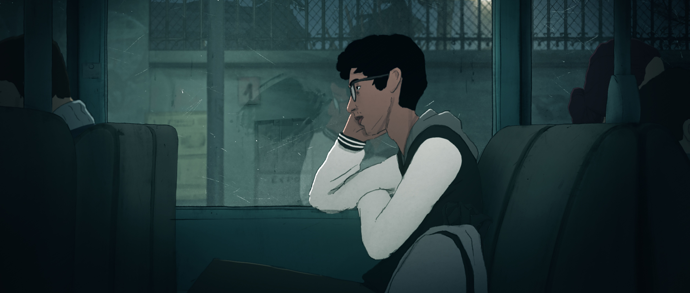
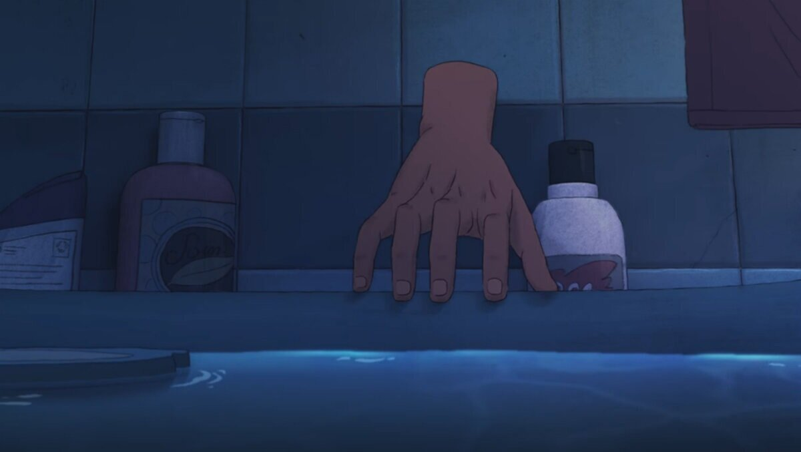
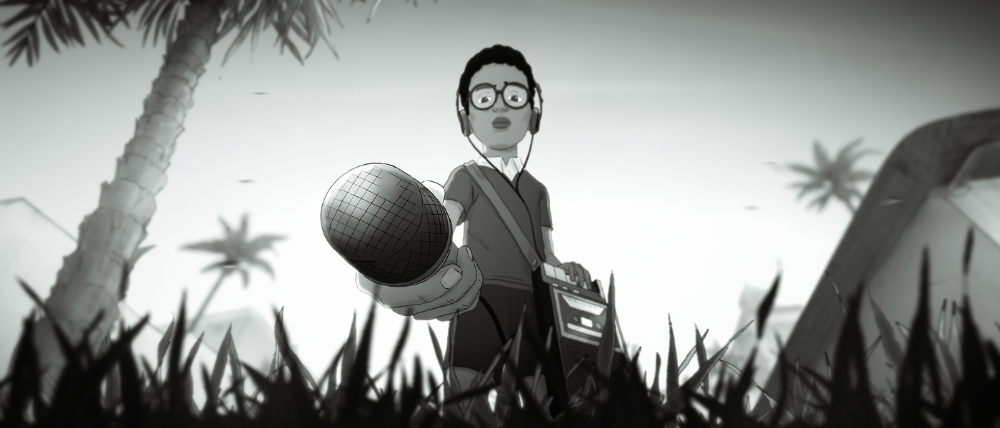
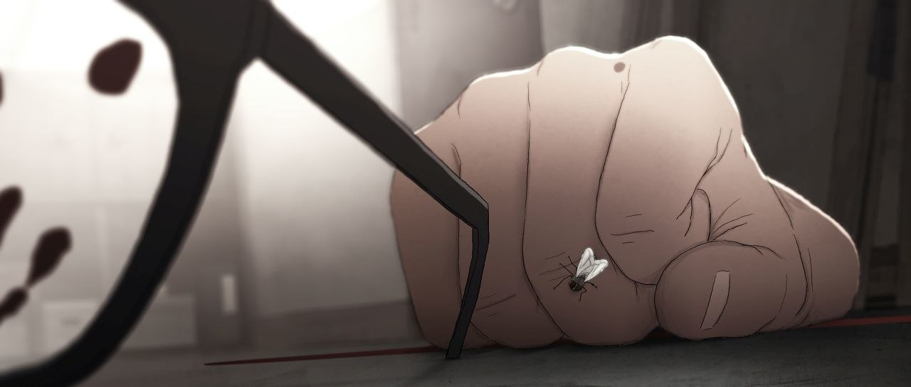

import Rating from '../../src/components/Movie/Rating';
import netflix from '../thumbnails/netflix.png';

The 2019 French animated drama fantasy film `I Lost My Body` (French : _J'ai perdu mon corps_) is a heart wrenching story of a young man `Naoufel`, directed by Jérémy Clapin. His story is told in flashbacks, which draws it's viewers into the interesting and immersive plot.

### Excerpt

The story is all about a severed hand, that escapes it's despondent fate and sets out to reconnect with it's body in this Academy Award nominee. After all, there's a reason why it's called **'I Lost My Body'** and not **'I Lost My Hand'**: it's largely told from the hand's point of view.

### Overview

The film initiates from Naoufel's childhood, beautifully portrayed in black-and-white, which lets us in on the bond between the body and hand. The story builds up showing Naoufel and his hand wokring in harmony and allowing each other to feel the world around them, with their **tape recorder**. Grains of sand running through his fingers; bath water spreading over his palm; the smooth keys of his mother’s piano submitting to just the slightest hint of pressure.

The film follows a young Naoufel always trying to capture a housefly, at which he fails everytime. In my opinion, this fly play a major part in the film, which I don't think I should reveal.

But on the other hand (_sorry!_ 😅), just as a summary of what the fly is, basically is a representation of his destiny and only seems to make an appearance only during moments that are far beyond the control of the protagonist. From the time he ends up losing his parents in a car accident to the incident where he chops off his own arm, the fly seems to be omnipresent. Such miniscule moments in the film add to it's inherent beauty!

### _la fin_ : A rollercoaster of emotions

In the final moments of ‘I Lost My Body’, the hand does find its way back to Naoufel, but it still struggles to re-attach itself with its owner. The tapes had always been a self-destructive reminder to him of how he is just a mere victim of his own circumstances. But his final drastic step sets him free and liberates him from the noxious memories of his past. With this, even the hand realizes that its owner has moved on ahead with his life and won’t be needing it anymore. While the hand slowly drifts away into the darkness, Naoufel realizes that he may not always get everything in life, but he must learn to go with the flow and take life as it comes to him. In the end, both, the hand and the main character, learn to accept that they will always be leaving behind a part of them with all of life’s stumbling blocks, but that does not mean that they should stop practicing their own free will.

#### Critique

As inventive a piece of animation as you’re likely to see, the extraordinary 'I Lost My Body' is about a hand with a mind of its own, and if that sounds a little crazy, this dark, strange and altogether wonderful feature will make you believe.

<Rating stars={4} link="https://www.netflix.com/watch/81120982" thumbnail={netflix} />
